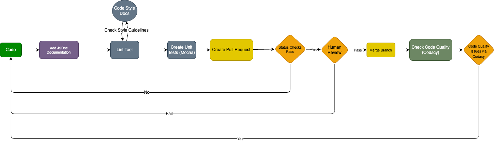

# Project Pipeline (Phase 1)

## Code
Since we haven’t really started writing code for our project yet, we will be using some sample code including simple functionalities to demonstrate the CI/CD process and test out the desired pipeline functionalities.

As the project progresses, our objective is to transition from sample code to more complex features that reflect the actual functionality intended for the final project, ensuring each new piece of our code is fully integrated into the CI/CD pipeline process.

## JSDoc Documentation
We will integrate JSDoc into our CI/CD pipeline to automatically generate documentation for our JavaScript source code. Our documentation will include descriptions of functions, parameters, and return values, which helps maintain clarity and understanding of the source code across the team. We would also have the setup that ensures the documentation is updated with every commit, providing immediate feedback and accessible references for all team members. 

## Linting Tool
Since we haven’t started coding, we do not have any code to lint yet. We can use sample code that is in need of linting, and demonstrate this step in the CI/CD pipeline to test out how we may catch code inconsistencies in regards to valid syntax and code style.

The specific linting tool our team has decided to collectively use is called **ESLint**. ESLint is a highly configurable and flexible tool that will help us maintain a consistent coding style across our project. It will analyze our JavaScript code for potential errors and deviations from our agreed-upon coding standards. 

As we start writing code, ESLint will be an important tool in our CI/CD pipeline. It will automatically check our code during the development phase, catching any inconsistencies or potential issues before they make it into our main codebase. This will help us ensure that our code is not only functional, but also clean, consistent, and adhering to the best practices we've set as a team.

The only thing our team has to decide upon are the actual styling rules which we want to hold each team member to following, and once that is done we can update the ESLint config file accordingly. We plan to meet and all discuss and come to an agreement upon a formalized style guide/documentation. We want this because it will ensure team uniformity during the coding process, and reduce coding style ambiguity. This form will be placed in our team resources to be referenced as needed at any time during the sprint.

## Unit Tests
We will create unit tests to verify the functionality and correctness of the code to demonstrate the CI/CD process and test out the desired pipeline functionalities.

The specific tool we will use for unit tests will be Mocha, which is a testing framework which our team will be using to mainly test JavaScript logic and code. The unit tests will be automated with Github actions, which will require the unit tests to pass before merging a pull request.

## Create Pull Requests and Human Review
The process of creating pull requests is fully implemented. Once the source code passes the locally Unit Tests, we will use pull requests to initiate code reviews before merging changes into the main branch. This ensures that all changes are visible and open for feedback from other team members. 

Human review is also an integral part of our CI/CD process. All pull requests require at least one review from a team member before merging. This review focuses on code quality, functionality, and overall fit within the project architecture.

## Code Quality via Codacy
Our team has decided to use the platform Codacy to maintain a general overview and to keep a centralized tracking system of our repo's open pull requests, code styling issues, and code coverage. For now, the only working part of this is the code styling which is tracked on our Codacy, but the code coverage part has still not been linked yet, but will be soon. Once this is completed, Codacy will provide our entire team with a convenient way to stay on top of any issues that have to do with new code added to our codebase.

